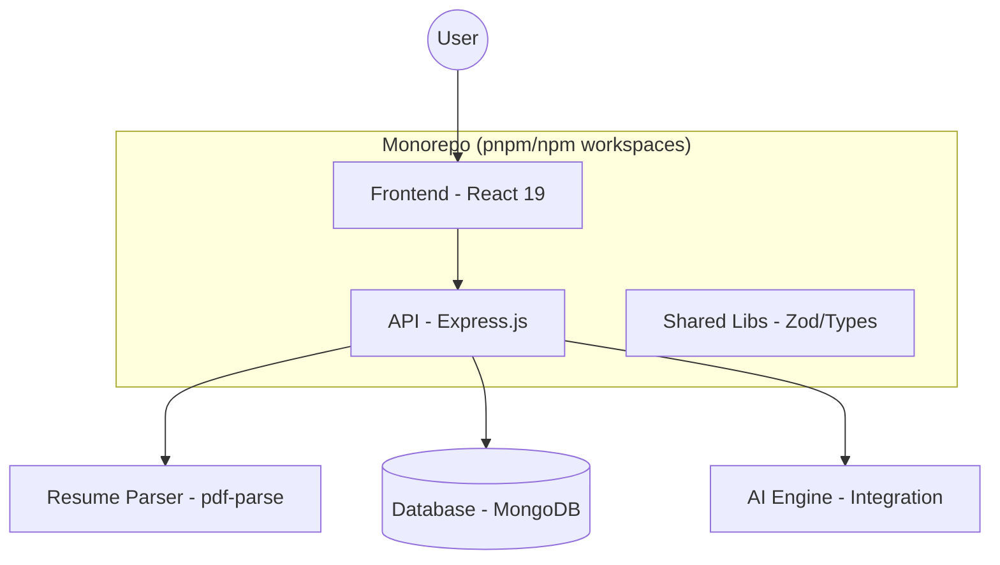

# AI Resume & Portfolio Optimizer 🚀

[](https://opensource.org/licenses/MIT)
[](https://reactjs.org/)
[](https://tailwindcss.com/)
[](https://nodejs.org/)

A high-performance, AI-driven platform for optimizing resumes and portfolios. Built with a modern monorepo architecture, this project leverages React 19, Tailwind CSS v4, and a sophisticated AI parsing pipeline to transform raw career data into professional, high-fidelity documents.

---

## 📋 Table of Contents
- [🌟 Key Features](#-key-features)
- [🏗️ Architecture](#️-architecture)
- [📂 Folder Structure](#-folder-structure)
- [🛠️ Technology Stack](#️-technology-stack)
- [🚀 Quick Start](#-quick-start)
- [📝 Scripts Reference](#-scripts-reference)
- [⚙️ Configuration](#️-configuration)
- [🔌 API & Database](#-api--database)
- [🤝 Contributing](#-contributing)

---

## 🌟 Key Features

### 1. Intelligent Resume Parsing
- **Three-Phase Normalization**: A robust pipeline that handles complex section headings, title-case formatting, and project descriptions.
- **Context-Aware Parsing**: Uses advanced heuristics to correctly identify work experience vs. education vs. skills.
- **Contact Info Stabilization**: Correctly groups emails, phones, and links even with irregular spacing or line breaks.

### 2. Premium Design System
- **LaTeX-Inspired Aesthetic**: Synchronized, professional visual styles across the Rewrite and Diff views.
- **Dynamic Previews**: Real-time rendering of resume changes with a high-fidelity "Print Preview" mode.
- **Responsive Layout**: Fluid design that works on mobile and desktop while maintaining print-perfect proportions.

### 3. AI Optimizations
- **Content Scoring**: Get real-time feedback on your resume's impact.
- **Smart Rewrite**: AI-suggested improvements for bullet points and summaries.
- **ATS Optimization**: Ensures your resume is readable by automated tracking systems.

---

## 🏗️ Architecture



---

## 📂 Folder Structure

```text
AI Resume & Portfolio Optimizer/
├── backend/                # Express.js API Server
│   ├── src/                # Controllers, Routes, and Middleware
│   ├── dist/               # Compiled code (generated)
│   └── build.mjs           # Custom build orchestrator
├── frontend/               # React 19 + Vite + Tailwind 4
│   ├── src/                # UI Components, Pages, and Global State
│   ├── public/             # Static Assets & Icons
│   └── vite.config.ts      # Vite optimization settings
├── lib/                    # Shared Workspace Libraries
│   ├── api-client-react/   # React hooks for API interaction
│   ├── api-spec/           # Centralized API definitions
│   ├── api-zod/            # Shared validation schemas
│   └── db/                 # Mongoose models and DB logic
├── api/                    # Vercel Serverless Function entrypoints
├── scripts/                # Development and maintenance scripts
├── dev.mjs                 # Unified Dev Orchestrator (Run All)
├── package.json            # Root workspace configuration
└── pnpm-workspace.yaml     # Workspace definition
```

---

## 🛠️ Technology Stack

| Layer | Technology |
| :--- | :--- |
| **Frontend** | React 19, Vite, Tailwind CSS v4, Framer Motion, Wouter |
| **Backend** | Node.js, Express, MongoDB (Mongoose) |
| **Parsing** | pdf-parse, custom normalization pipeline |
| **Validation** | Zod |
| **State Management** | TanStack React Query (v5) |
| **Styling** | Lucide React, Shadcn/UI (Tailwind v4 optimized) |

---

## 🚀 Quick Start (The "Run All" Guide)

Follow these steps to get the entire project up and running.

### 1. Navigate to Project Root
```bash
cd "AI Resume & Portfolio Optimizer"
```

### 2. Install Dependencies
Choose your preferred package manager:
- **npm**: `npm install`
- **pnpm**: `pnpm install`

### 3. Run Everything (Frontend + Backend)
- **npm**: `npm run dev`
- **pnpm**: `pnpm dev`

> [!TIP]
> This command triggers `node ./dev.mjs`, which automatically:
> 1. Builds the backend logic.
> 2. Starts the API server on **Port 5000**.
> 3. Launches the Vite development server on **Port 3000**.

---

## 📝 Scripts Reference

| Action | **npm** Command | **pnpm** Command | Description |
| :--- | :--- | :--- | :--- |
| **Dev Mode** | `npm run dev` | `pnpm dev` | Runs full stack in watch mode |
| **Install** | `npm install` | `pnpm install` | Installs all workspace deps |
| **Build** | `npm run build` | `pnpm build` | Production-ready compilation |
| **Typecheck** | `npm run typecheck` | `pnpm typecheck` | Full workspace TS validation |
| **Fix Parser**| `npm run fix-parser`| `pnpm run fix-parser`| Utility to repair parsing logic |

---

## ⚙️ Configuration

Create a `.env` file in the root directory.

```env
# Backend Configuration
PORT=5000
MONGODB_URI=mongodb://localhost:27017/resume_optimizer
JWT_SECRET=your_secret_here

# Frontend Configuration
VITE_API_URL=http://localhost:5000
```

---

## 🔌 API & Database

### Core Models (`lib/db`)
- **Resume**: Stores raw and normalized resume data.
- **User**: Authentication and user profile settings.
- **Optimization**: History of AI suggestions and applied changes.

### Key API Endpoints
- `POST /api/resume/upload`: Uploads and parses a PDF.
- `GET /api/resume/:id`: Retrieves optimized resume data.
- `PATCH /api/resume/:id`: Applies AI-suggested updates.

---

## 🤝 Contributing

1. **Fork** the repository.
2. **Create** your feature branch (`git checkout -b feature/AmazingFeature`).
3. **Commit** your changes (`git commit -m 'Add some AmazingFeature'`).
4. **Push** to the branch (`git push origin feature/AmazingFeature`).
5. **Open** a Pull Request.

---

*Generated by ❤️ reza*
